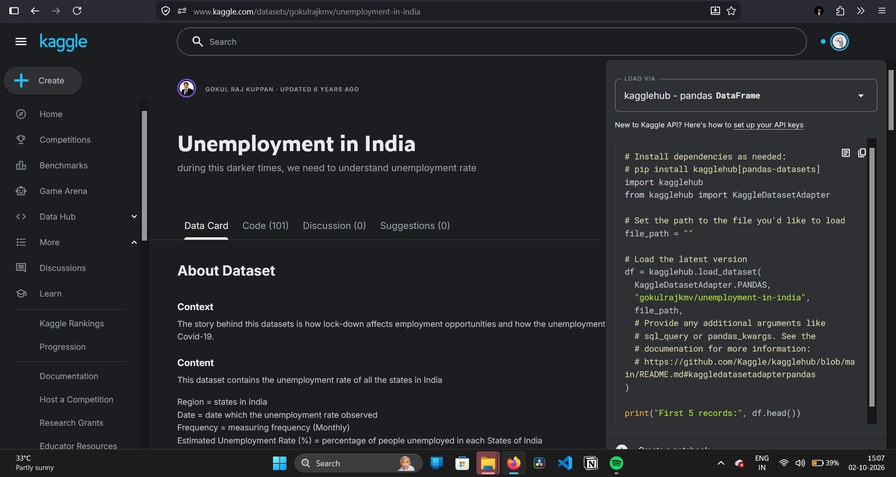
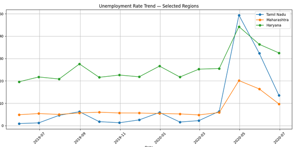
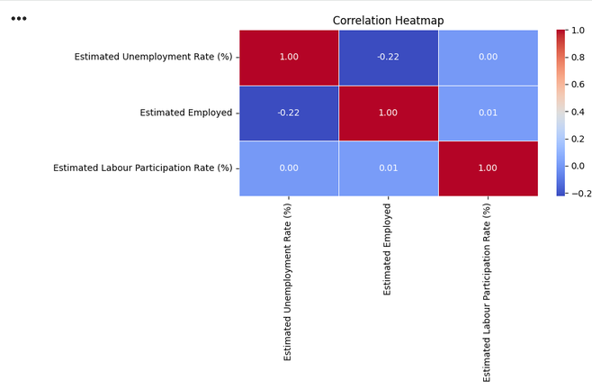
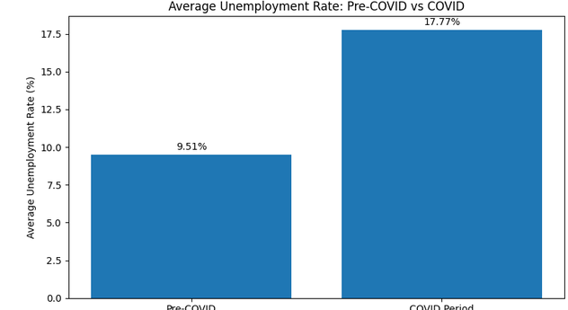

# Unemployment Analysis with Python

## Oasis Infobyte — Data Science Internship

### Task 2: Unemployment Analysis with Python

An end-to-end data analysis project that explores unemployment trends across different regions of India using Python. The project covers data collection, data cleaning, exploratory data analysis, regional analysis, time-series analysis, correlation analysis, COVID-19 impact analysis, visualization, and insight generation.

## Objectives

- Analyze unemployment rates across Indian regions
- Identify regions with high average unemployment
- Analyze monthly unemployment trends
- Compare unemployment trends across selected regions
- Study the relationship between unemployment, employment, and labour participation
- Compare pre-COVID and COVID-period unemployment rates
- Generate meaningful visualizations and insights

## Dataset

**Dataset:** Unemployment in India

**Source:** Kaggle



**Dataset ID:** `gokulrajkmv/unemployment-in-india`

**Date Range:** May 2019 – June 2020

### Dataset Features

| Feature | Description |
|---|---|
| Region | Indian state or region |
| Date | Observation date |
| Frequency | Frequency of data collection |
| Estimated Unemployment Rate (%) | Unemployment percentage |
| Estimated Employed | Estimated number of employed people |
| Estimated Labour Participation Rate (%) | Labour participation percentage |
| Area | Rural or Urban area |

## Technologies Used

- Python
- Pandas
- NumPy
- Matplotlib
- Seaborn
- KaggleHub
- Google Colab
- Jupyter Notebook

## Project Workflow

```text
Dataset Collection
        ↓
Data Loading
        ↓
Data Inspection
        ↓
Data Cleaning
        ↓
Missing Value Analysis
        ↓
Duplicate Check
        ↓
Date Processing
        ↓
Exploratory Data Analysis
        ↓
Statistical Analysis
        ↓
Regional Analysis
        ↓
Monthly Trend Analysis
        ↓
Time-Series Analysis
        ↓
Correlation Analysis
        ↓
COVID-19 Analysis
        ↓
Visualization
        ↓
Key Findings
        ↓
Conclusion
```

## Data Cleaning

The dataset was cleaned and prepared before performing the analysis.

### Cleaning Results

| Stage | Records |
|---|---:|
| Original Dataset | 768 |
| Empty Rows Removed | 28 |
| Final Dataset | 740 |

### Cleaning Steps

- Removed empty rows
- Checked missing values
- Checked duplicate records
- Converted the date column to datetime format
- Validated numerical columns
- Verified the final dataset structure

## Exploratory Data Analysis

The following variables were analyzed:

- Estimated Unemployment Rate
- Estimated Employed
- Estimated Labour Participation Rate
- Region
- Date
- Area

Basic statistical measures such as mean, median, minimum, maximum, and standard deviation were calculated.

## Overall Unemployment Analysis

The overall average unemployment rate across the cleaned dataset was:

**11.79%**

This provides an overall view of unemployment during the analyzed period.

## Region-wise Average Unemployment

The average unemployment rate was calculated for each region.

| Region | Average Unemployment |
|---|---:|
| Tripura | 28.35% |
| Haryana | 26.28% |
| Jharkhand | 20.59% |
| Bihar | 18.92% |
| Himachal Pradesh | 18.54% |

Tripura recorded the highest average unemployment rate among the analyzed regions.

## Monthly Unemployment Trend



The monthly unemployment rate was analyzed from **May 2019 to June 2020**.

A significant increase in unemployment was observed during April and May 2020.

### May 2020

**Average Unemployment Rate: Approximately 24.88%**

## Time-Series Analysis

Unemployment trends were compared across selected regions:

- Tamil Nadu
- Maharashtra
- Haryana

The time-series analysis helps identify changes, fluctuations, and regional differences over time.

## Top 10 Regions Analysis

The top 10 regions with the highest average unemployment rates were identified and visualized using a bar chart.

This provides a clear comparison of unemployment levels across different regions.

## Correlation Analysis
The relationship between the following variables was analyzed:

- Estimated Unemployment Rate
- Estimated Employed
- Estimated Labour Participation Rate

### Unemployment vs Employment

The correlation between unemployment rate and estimated employment was approximately:

**-0.22**

This indicates a weak negative linear relationship within the analyzed dataset.

> Correlation does not imply causation.

## Correlation Heatmap

A correlation heatmap was created using Seaborn to visualize relationships between the numerical variables.

The heatmap helps identify positive and negative relationships between unemployment, employment, and labour participation.



## COVID-19 Impact Analysis

The dataset was divided into two periods to compare unemployment before and during the COVID-19 period.

### Pre-COVID Period

**May 2019 – February 2020**

Average unemployment rate:

**9.51%**

### COVID Period

**March 2020 – June 2020**

Average unemployment rate:

**17.77%**

### Change in Unemployment

The average unemployment rate increased by approximately:

**8.26 percentage points**

during the COVID-period window.

## Visualizations

The project includes:

- Dataset overview
- Monthly unemployment trend
- Regional time-series comparison
- Top 10 regions by average unemployment
- Correlation heatmap
- Pre-COVID vs COVID comparison



## Key Findings

- Overall average unemployment rate was **11.79%**
- Tripura recorded the highest average unemployment rate at **28.35%**
- Haryana recorded the second-highest average unemployment rate at **26.28%**
- Jharkhand recorded an average unemployment rate of **20.59%**
- Bihar recorded an average unemployment rate of **18.92%**
- Himachal Pradesh recorded an average unemployment rate of **18.54%**
- Unemployment increased sharply during April and May 2020
- May 2020 recorded an average unemployment rate of approximately **24.88%**
- Pre-COVID average unemployment was **9.51%**
- COVID-period average unemployment was **17.77%**
- The difference between the two periods was approximately **8.26 percentage points**
- The correlation between unemployment and estimated employment was approximately **-0.22**

## Project Structure

```text
DataScience-Task2-UnemploymentAnalysis/
│
├── UnemploymentAnalysis.ipynb
├── README.md
│
└── screenshots/
    ├── dataset.png
    ├── time_series.png
    ├── top_10_regions.png
    ├── correlation_heatmap.png
    └── covid_comparison.png
```

## Conclusion

This project demonstrates an end-to-end exploratory data analysis of unemployment trends in India using Python.

The project covers the complete data analysis workflow, including dataset collection, data cleaning, exploratory data analysis, regional comparison, monthly trend analysis, time-series analysis, correlation analysis, COVID-19 comparison, visualization, and insight generation.

The analysis highlights significant regional differences in unemployment and a substantial increase in unemployment during the COVID-period window.

## Future Improvements

- Use newer unemployment datasets
- Extend the analysis to a longer time period
- Build an interactive dashboard using Power BI or Tableau
- Apply statistical hypothesis testing
- Develop unemployment forecasting models
- Apply machine learning for unemployment prediction
- Include GDP and inflation indicators
- Include demographic and education-level indicators
- Build a real-time unemployment monitoring dashboard

