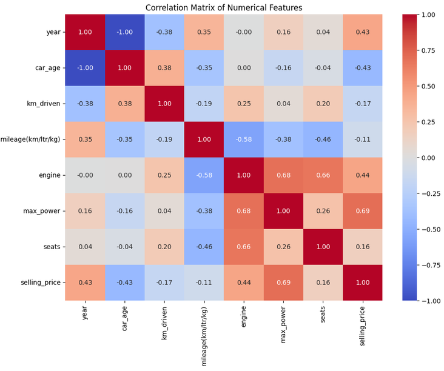

# Car Price Prediction Using Machine Learning

Predicting Used Car Selling Prices Using Regression Models

## Project Overview

This project was developed as part of the **Oasis Infobyte Data Science Internship Program**.

The objective of this project is to build a machine learning regression system that predicts the selling price of used cars based on vehicle characteristics such as brand, age, mileage, fuel type, transmission, ownership history, engine capacity, and maximum power.

The project covers the complete machine learning workflow, including data cleaning, feature engineering, exploratory data analysis, categorical encoding, model training, model evaluation, feature importance analysis, error analysis, and sample price prediction.

---

## Problem Statement

Used car prices depend on several factors such as the vehicle's brand, age, mileage, fuel type, transmission, ownership history, engine capacity, and power.

The goal of this project is to develop a regression-based machine learning system that learns relationships between these vehicle characteristics and their selling prices.

---

## Objectives

- Understand and clean the used-car dataset
- Handle missing values and duplicate records
- Perform exploratory data analysis
- Extract useful features such as car brand
- Engineer car age from manufacturing year
- Encode categorical variables
- Train multiple regression models
- Evaluate models using MAE, RMSE, and R²
- Compare model performance
- Analyse feature importance
- Perform error analysis
- Test the model using sample vehicles

---

## Dataset

The dataset used in this project is the **Car Price Prediction Dataset** obtained from Kaggle.

### Dataset Information

- Original records: 8,128
- Original columns: 12
- Records after duplicate removal: 6,926
- Target variable: `selling_price`

### Features

| Feature | Description |
|---|---|
| `name` | Complete vehicle/model name |
| `year` | Manufacturing year |
| `selling_price` | Used-car selling price — target |
| `km_driven` | Kilometres driven |
| `fuel` | Fuel type |
| `seller_type` | Type of seller |
| `transmission` | Manual or Automatic |
| `owner` | Ownership history |
| `mileage(km/ltr/kg)` | Vehicle mileage |
| `engine` | Engine capacity |
| `max_power` | Maximum power |
| `seats` | Number of seats |

---

## Technologies Used

- Python
- Pandas
- NumPy
- Matplotlib
- Seaborn
- Scikit-learn
- Google Colab
- GitHub
- Kaggle

---

## Project Workflow

```text
Kaggle Dataset
      ↓
Dataset Loading
      ↓
Dataset Understanding
      ↓
Data Cleaning
      ├── Duplicate Removal
      ├── Missing Value Handling
      └── Data Type Conversion
      ↓
Feature Engineering
      ├── Brand Extraction
      └── Car Age Creation
      ↓
Exploratory Data Analysis
      ↓
Feature Selection
      ↓
Train/Test Split
      ↓
One-Hot Encoding
      ↓
Model Training
      ├── Linear Regression
      └── Random Forest Regressor
      ↓
Model Evaluation
      ├── MAE
      ├── RMSE
      └── R²
      ↓
Model Comparison
      ↓
Feature Importance
      ↓
Error Analysis
      ↓
Sample Price Prediction
```

---

## Data Cleaning

The original dataset contained:

- 8,128 records
- 1,202 duplicate records
- Missing values in mileage
- Missing values in engine
- Missing values in maximum power
- Missing values in seating capacity

The following preprocessing steps were performed:

1. Removed exact duplicate records.
2. Imputed missing numerical values using median values.
3. Converted `max_power` from object/string format to numerical format.
4. Imputed missing `max_power` values using its median.
5. Verified that no missing values remained.
6. Verified that no duplicate records remained.

### Final Cleaned Dataset

```text
Records: 6,926
Columns: 12
Missing values: 0
Duplicate rows: 0
```

---

## Feature Engineering

### Brand Extraction

The vehicle brand was extracted from the `name` column.

Example:

```text
Maruti Swift Dzire VDI
        ↓
Maruti
```

The dataset contains 32 unique brands.

### Car Age

Car age was calculated using 2020, the maximum manufacturing year present in the dataset, as the reference year.

```text
car_age = 2020 - manufacturing_year
```

The resulting car age ranges from 0 to 37 years.

---

## Exploratory Data Analysis

The following relationships were investigated:

- Selling price distribution
- Selling price by fuel type
- Selling price by transmission
- Selling price by seller type
- Car age versus selling price
- Kilometres driven versus selling price
- Numerical feature correlations

The correlation analysis showed notable relationships between selling price and features such as `max_power`, `engine`, `year`, and `car_age`.

The analysis also identified several high-value selling-price observations. These were not automatically removed because an extreme value is not necessarily an invalid observation.

---

## Feature Selection

### Numerical Features

```text
car_age
km_driven
mileage(km/ltr/kg)
engine
max_power
seats
```

### Categorical Features

```text
brand
fuel
seller_type
transmission
owner
```

The original `name` column was excluded from the initial model because it contains high-cardinality vehicle model names.

The original `year` column was excluded after creating the `car_age` feature.

---

## Train/Test Split

The cleaned dataset was divided into:

```text
80% → Training
20% → Testing
```

Result:

```text
Training samples: 5,540
Testing samples: 1,386
```

The test set was reserved for final model evaluation.

---

## Categorical Encoding

Categorical variables were converted into numerical representations using **One-Hot Encoding**.

The categorical features encoded were:

- `brand`
- `fuel`
- `seller_type`
- `transmission`
- `owner`

The preprocessing and machine learning model were combined using a Scikit-learn Pipeline.

---

## Machine Learning Models

Two regression models were trained and evaluated.

### 1. Linear Regression

Linear Regression was used as the baseline regression model.

### 2. Random Forest Regressor

Random Forest was used to capture nonlinear relationships and interactions between vehicle characteristics and selling price.

Both models were evaluated on the same held-out test dataset.

---

## Model Evaluation

The models were evaluated using:

### Mean Absolute Error — MAE

Measures the average absolute difference between actual and predicted selling prices.

Lower values indicate smaller average prediction errors.

### Root Mean Squared Error — RMSE

Measures prediction error while giving greater weight to larger errors.

Lower values indicate smaller prediction errors.

### R² Score

Measures the proportion of variation in selling price explained by the model.

Higher values indicate that the model explains more variation in the target variable.

---

## Model Performance

| Model | MAE | RMSE | R² |
|---|---:|---:|---:|
| Linear Regression | ₹133,098.53 | ₹261,925.34 | 0.6872 |
| Random Forest | ₹72,813.50 | ₹127,099.92 | 0.9263 |

### Random Forest Test Results

```text
MAE  : ₹72,813.50
RMSE : ₹127,099.92
R²   : 0.9263
```

On the held-out test dataset, the Random Forest model produced lower MAE and RMSE and a higher R² score than the Linear Regression baseline.

---

## Actual vs Predicted Prices

The project includes an actual-versus-predicted visualization for the Random Forest model.

The visualization compares:

- Actual selling prices
- Predicted selling prices

Points closer to the diagonal reference line represent predictions closer to the actual selling prices.

---

## Feature Importance

Feature importance was extracted from the trained Random Forest model.

This analysis helps identify which transformed input features contributed most to the model's predictions.

The project includes a feature-importance visualization showing the most important transformed features.

---

## Error Analysis

Prediction errors were analysed using:

- Absolute prediction error
- Prediction error distribution
- Largest prediction errors
- Percentage error

This analysis helps identify observations where the model produces larger differences between actual and predicted selling prices.

---

## Sample Testing


The trained Random Forest pipeline was tested using multiple hypothetical vehicle inputs.

The sample inputs include:

- Brand
- Car age
- Kilometres driven
- Fuel type
- Seller type
- Transmission
- Ownership history
- Mileage
- Engine capacity
- Maximum power
- Seating capacity

The model produces an estimated selling price for each sample vehicle.

These predictions are model estimates based on the training dataset and should not be interpreted as actual market quotations.

---

## Project Structure

```text
DataScience-Task3-CarPricePrediction/
│
├── CarPricePrediction.ipynb
├── README.md
│
└── screenshots/
    ├── dataset.png
    ├── eda.png
    ├── correlation.png
    ├── model_comparison.png
    ├── actual_vs_predicted.png
    ├── feature_importance.png
    └── sample_prediction.png
```

---

## Limitations

- The dataset represents a particular collection of used-car records.
- The data is limited to the period represented in the dataset.
- Missing numerical values were handled using median imputation.
- The dataset contains extreme selling-price observations.
- Factors such as geographic location, vehicle condition, service history, and market demand are not fully represented.
- Model performance on future market data may differ from the held-out test-set performance.

---

## Future Improvements

Potential improvements include:

- Adding geographic and regional market information
- Including detailed vehicle-model information
- Incorporating vehicle condition and service history
- Testing additional regression algorithms
- Hyperparameter tuning
- Cross-validation
- Investigating appropriate treatment of extreme observations
- Deploying the model through FastAPI or Streamlit
- Saving the trained model and preprocessing pipeline for deployment
- Monitoring model performance on new data

---

## Conclusion

This project demonstrates an end-to-end machine learning workflow for used-car price prediction.

The workflow included data cleaning, feature engineering, exploratory data analysis, categorical encoding, model training, model evaluation, model comparison, feature importance analysis, error analysis, and sample prediction.

Two regression models were evaluated using MAE, RMSE, and R².

On the held-out test dataset, the Random Forest model achieved:

```text
MAE  : ₹72,813.50
RMSE : ₹127,099.92
R²   : 0.9263
```

The project demonstrates how structured vehicle information can be used to build a machine learning regression system for estimating used-car selling prices.
